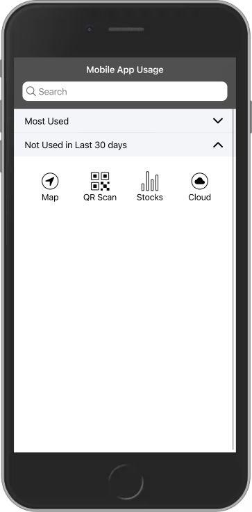

# Ionic Phone Usage App Demo

This project include demo UI for Phone Usage App. It is build using Ionic.





## How to Run the Project

You need to simply clone the project and then with in the project directory, you can run:

````
ionic serve

````

Note: You need to install Node and Ionic first.
